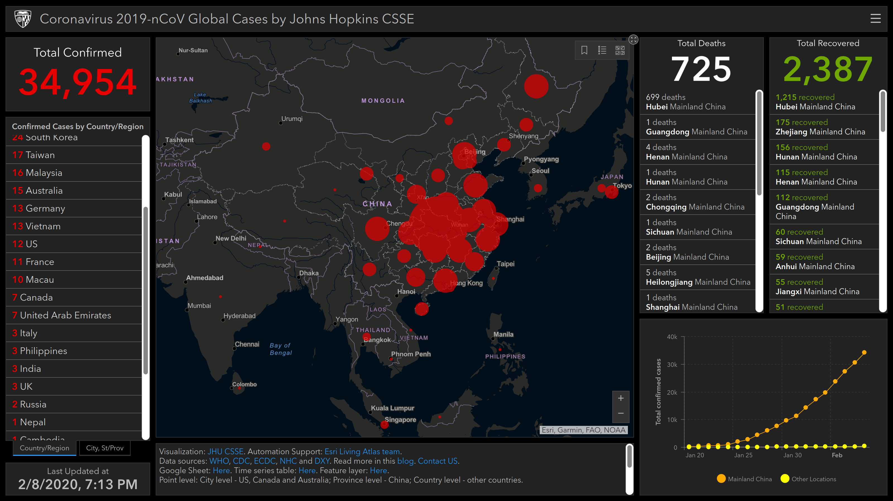
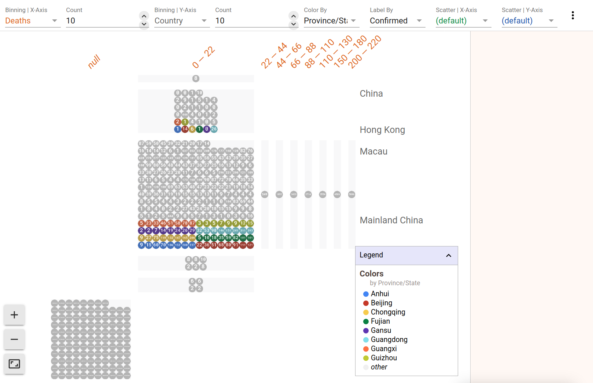
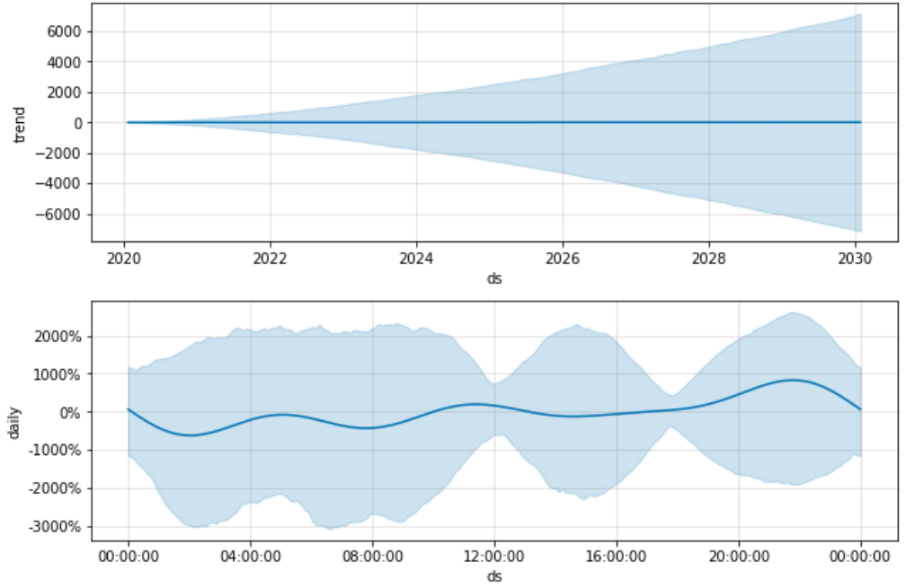
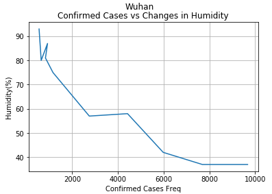
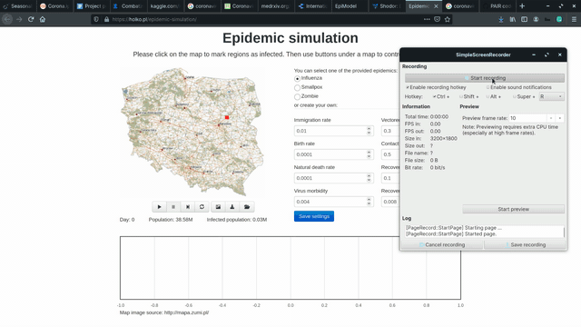

# Corona Prophet Prediction

[UPDATES] https://www.nature.com/articles/d41586-020-00154-w?utm_source=facebook&utm_medium=social&utm_content=organic&utm_campaign=NGMT_USG_JC01_GL_Nature&fbclid=IwAR3I1vxjD05wwXbGYzqt9jnXVPE6pUiQzbTjISHT6W-niFs5MistDkL2l80

2019-nCoV Global Cases by Johns Hopkins

https://gisanddata.maps.arcgis.com/apps/opsdashboard/index.html#/bda7594740fd40299423467b48e9ecf6

# 2019 Novel Coronavirus COVID-19 (2019-nCoV) Data Repository by Johns Hopkins CSSE

This is the data repository for the 2019 Novel Coronavirus Visual Dashboard operated by the Johns Hopkins University Center for Systems Science and Engineering (JHU CSSE). Also, Supported by ESRI Living Atlas Team and the Johns Hopkins University Applied Physics Lab (JHU APL).

 

<b>Visual Dashboard (desktop):</b> 
https://www.arcgis.com/apps/opsdashboard/index.html#/bda7594740fd40299423467b48e9ecf6
  
<b>Visual Dashboard (mobile):</b> 
http://www.arcgis.com/apps/opsdashboard/index.html#/85320e2ea5424dfaaa75ae62e5c06e61
  
<b>Lancet Article:</b> 
[An interactive web-based dashboard to track COVID-19 in real time](https://doi.org/10.1016/S1473-3099(20)30120-1)
  
<b>Provided by Johns Hopkins University Center for Systems Science and Engineering (JHU CSSE):</b> 
https://systems.jhu.edu/
  
<b>Data Sources:</b> 
* World Health Organization (WHO): https://www.who.int/  
* DXY.cn. Pneumonia. 2020. http://3g.dxy.cn/newh5/view/pneumonia.   
* BNO News: https://bnonews.com/index.php/2020/02/the-latest-coronavirus-cases/   
* National Health Commission of the People’s Republic of China (NHC):  
 http://www.nhc.gov.cn/xcs/yqtb/list_gzbd.shtml  
* China CDC (CCDC): http://weekly.chinacdc.cn/news/TrackingtheEpidemic.htm  
* Hong Kong Department of Health: https://www.chp.gov.hk/en/features/102465.html  
* Macau Government: https://www.ssm.gov.mo/portal/  
* Taiwan CDC: https://sites.google.com/cdc.gov.tw/2019ncov/taiwan?authuser=0  
* US CDC: https://www.cdc.gov/coronavirus/2019-ncov/index.html  
* Government of Canada: https://www.canada.ca/en/public-health/services/diseases/coronavirus.html  
* Australia Government Department of Health: https://www.health.gov.au/news/coronavirus-update-at-a-glance  
* European Centre for Disease Prevention and Control (ECDC): https://www.ecdc.europa.eu/en/geographical-distribution-2019-ncov-cases 
* Ministry of Health Singapore (MOH): https://www.moh.gov.sg/covid-19
* Italy Ministry of Health: http://www.salute.gov.it/nuovocoronavirus

 
<b>Additional Information about the Visual Dashboard:</b> 
https://systems.jhu.edu/research/public-health/ncov/
  

<b>Contact Us: </b> 
* Email: jhusystems@gmail.com
  

<b>Terms of Use:</b> 

This GitHub repo and its contents herein, including all data, mapping, and analysis, copyright 2020 Johns Hopkins University, all rights reserved, is provided to the public strictly for educational and academic research purposes.  The Website relies upon publicly available data from multiple sources, that do not always agree. The Johns Hopkins University hereby disclaims any and all representations and warranties with respect to the Website, including accuracy, fitness for use, and merchantability.  Reliance on the Website for medical guidance or use of the Website in commerce is strictly prohibited.

>***Can we build an original, comprehensive solution to help handle the crisis?***

>***We are looking to predict, visualize and act to contain the 2019 n-Coron Virus, through the power of data science.***

With the objective of understanding and minimizing epidemic spread, we devloped an method to accuractely predict and visualize the necessary features relating to **n-Corona virus** using *Time Series Analysis* and *EDA*.

The following dataset has been taken from 
[Novel Corona Virus 2019 Dataset:](https://www.kaggle.com/sudalairajkumar/novel-corona-virus-2019-dataset) along with custom feature engineering by extracting data from web.

### Kernels 

* Mathematical Simulation of nCOV Transmission Model.
* Feature engineeing and analysis of their effects in predicting extent of the nCOV Virus.
* Prediction model for expected new cases in the Mainland China region. 
* Prediction model for expected new cases in the Mainland China region.

## Mainland China* Death Trends

Following trend indicates **daily,weekly,monthly** trend in confirmed death rates in China .It was obtained using [Prophet](https://facebook.github.io/prophet/) an open source tool for Time Series analysis.

*Mainland China includes SAR provinces and Hong Kong.

## Uncertainty in Prediction

## Prediction with uncertainty and changepoint  

## Long-term forecast and trends

## Correlation Matrix 

**_Pearson’s correlation coefficient is the test statistics that measures the statistical relationship, or association, between two continuous variables.  It is known as the best method of measuring the association between variables of interest because it is based on the method of covariance.  It gives information about the magnitude of the association, or correlation, as well as the direction of the relationship._**

Features include  *StockPrice*,*Lowest/Highest Daily Temperature*,*Humidity(%)*,*StockPrice*,*Currency*,search terms such as *cold,etc*.

## Feature Relationships
We explore the relationship of various features with the spread of the disease  by plotting graphs.

- Stock Price Relationship

-  Humidity  Relationship

-  Flights Search  Relation

-  Lowest Temperature  Relation

# Simulations

# References and citations 

[1] https://www.kaggle.com/sudalairajkumar/novel-corona-virus-2019-dataset

[2] https://www.cdc.gov/coronavirus/2019-ncov/index.html

[3]https://gisanddata.maps.arcgis.com/apps/opsdashboard/index.html#/bda7594740fd40299423467b48e9ecf6

[4] https://www.who.int/emergencies/diseases/novel-coronavirus-2019/technical-guidance

[5]https://www.maa.org/press/periodicals/loci/joma/the-sir-model-for-spread-of-disease-the-differential-equation-model

[6]https://facebook.github.io/prophet/

[7]https://ai.googleblog.com/2017/07/facets-open-source-visualization-tool.html

[8]https://scikit-learn.org/stable/

[9]https://seaborn.pydata.org/

[10]https://colab.research.google.com/

[11]https://github.com/CSSEGISandData/COVID-19/

